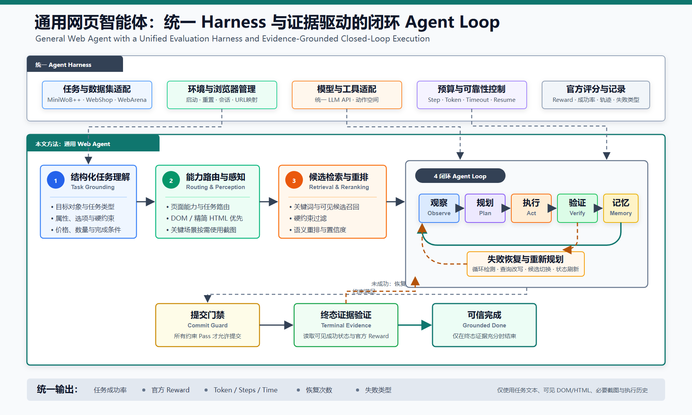

# EviLoop

**Evidence-Grounded Closed-Loop Web Agent**

EviLoop is a general web-agent method built on top of
[Browser Use](https://github.com/browser-use/browser-use). It keeps the agent loop,
but makes each loop evidence-aware: compact HTML/DOM observations are grounded to
visible controls, candidate actions are reranked against task constraints, progress
is stored in structured memory, and irreversible actions are verified before commit.



## Method

EviLoop adds five reusable components without reading private benchmark databases or
hard-coding task answers:

1. **HTML-first evidence extraction** prunes noisy DOM content while preserving visible,
   task-relevant controls. Screenshots are used only when visual evidence is necessary.
2. **Semantic candidate reranking** scores observed controls and records against the
   constraints in the user task.
3. **Structured execution memory** tracks completed constraints, failed actions,
   selected candidates, and remaining subgoals across a long trajectory.
4. **Verified commit guard** blocks submit, purchase, or other irreversible actions
   until required visible options and task constraints have been checked.
5. **Budgeted recovery loop** detects stalls, limits repeated actions, and chooses a
   bounded recovery or early termination path.

The implementation is primarily under:

- `browser_use/general_policy/`
- `browser_use/tools/control_state.py`
- `browser_use/tools/generic_actions.py`
- `browser_use/tools/generic_task_runtime.py`
- `browser_use/tools/task_policy.py`
- `browser_use/agent/prompts.py`
- `tests/ci/evaluate_tasks.py`

## 实验结果

除特别说明外，实验使用 Qwen3-VL-32B-Instruct。每张表内部使用相同的冻结任务、
随机种子和评测器。`adapted` 表示在共享 Browser Use harness 中实现论文思想，不能视为
对应方法官方系统的复现结果。

### 主实验一：历史三 Seed 对比

MiniWoB++ 与 WebShop 各包含 50 条任务/Seed。EviLoop、Reflexion 和原版 Browser Use
运行 3 个 Seed，其余 adapted 方法当前运行 1 个 Seed。

| 方法 | 样本 / Seed | 总成功率 | MiniWoB++ | WebShop | 复现类型 |
|---|---:|---:|---:|---:|---|
| **EviLoop** | 300 / 3 | **69.0%** | 71.3% | **66.7%** | 本文方法 |
| Reflexion | 300 / 3 | 51.0% | **78.0%** | 24.0% | Adapted |
| 原版 Browser Use | 300 / 3 | 44.7% | 67.3% | 22.0% | 本地基线 |
| ADaPT | 100 / 1 | 47.0% | 76.0% | 18.0% | Adapted |
| AgentOccam | 100 / 1 | 46.0% | 70.0% | 22.0% | Adapted |
| WebOperator | 100 / 1 | 45.0% | 72.0% | 18.0% | Adapted |
| WebDART | 100 / 1 | 40.0% | 62.0% | 18.0% | Paper-derived adapted |
| WebChallenger | 100 / 1 | 39.0% | 66.0% | 12.0% | Adapted |
| AdaPlanner | 100 / 1 | 34.0% | 42.0% | 26.0% | Adapted |

### 主实验二：最新同任务固定子集（Seed 17）

| 数据集 | 样本数 | **EviLoop** | AgentOccam adapted | 原版 Browser Use |
|---|---:|---:|---:|---:|
| MiniWoB++ | 50 | **48/50（96.0%）** | 36/50（72.0%） | 33/50（66.0%） |
| WebShop | 50 | **32/50（64.0%）** | 12/50（24.0%） | 12/50（24.0%） |
| WebArena Shopping | 50 | **17/50（34.0%）** | 3/50（6.0%） | 4/50（8.0%） |
| WebArena Shopping Admin | 55 | **8/55（14.5%）** | 2/55（3.6%） | 2/55（3.6%） |
| WebArena Reddit | 42 | **14/42（33.3%）** | 3/42（7.1%） | 2/42（4.8%） |
| WebArena GitLab | 57 | 7/57（12.3%） | **9/57（15.8%）** | 3/57（5.3%） |
| **WebArena 四站合计** | **204** | **46/204（22.5%）** | 17/204（8.3%） | 11/204（5.4%） |

在 WebArena Shopping Admin、Reddit 和 GitLab 的 154 条配对任务上，EviLoop 独立
成功 23 条、AgentOccam 独立成功 8 条、共同成功 6 条，McNemar 精确检验
`p=0.010674`。GitLab 是当前例外：AgentOccam 的成功率高于 EviLoop。

历史三 Seed 表与最新固定子集表来自不同代码检查点，因此分别报告，不跨表合并计算。

### WebShop 消融实验（稳定重跑，Seed 17）

以下结果来自同一冻结 WebShop-50 任务清单、Seed 17、Qwen3-VL-32B-Instruct、官方
WebShop reward 评测器和稳定代码检查点。任务成功要求 reward `>= 0.99`。有效结账
表示评测器返回了最终 reward；结账精度为成功数/有效结账数。平均 Reward 在全部
50 条任务上计算，未完成结账且没有最终 reward 的任务按 0 计入。

| 方法变体 | 成功率 | 有效结账 | 结账精度 | 平均 Reward | 平均 Token | 平均步骤 | 平均耗时 |
|---|---:|---:|---:|---:|---:|---:|---:|
| **完整方法 Full** | **28/50（56.0%）** | 30 | **93.3%** | **0.583** | 56,044 | 5.6 | 89.8 秒 |
| 去除长期/进度 Memory | 14/50（28.0%） | 15 | 93.3% | 0.293 | **11,663** | **5.0** | **34.7 秒** |
| 去除语义重排 | 14/50（28.0%） | 15 | 93.3% | 0.290 | 99,428 | 8.8 | 147.6 秒 |
| 去除提交门禁 | 22/50（44.0%） | **33** | 66.7% | 0.582 | 75,106 | 7.0 | 112.8 秒 |
| 去除恢复/重规划 | 20/50（40.0%） | 22 | 90.9% | 0.423 | 71,134 | 7.2 | 106.9 秒 |
| 仅通用 ReAct Agent | 5/50（10.0%） | 25 | 20.0% | 0.362 | 110,310 | 10.2 | 167.2 秒 |

Full 相比去除 Memory、语义重排、提交门禁和恢复/重规划分别提高 28、28、12 和
16 个百分点。去除提交门禁会产生更多结账，但结账精度从 93.3% 降至 66.7%，说明
门禁的主要作用是阻止不满足商品属性或选项约束的错误提交。

> **历史诊断结果说明：** 早期 `2026-08-02` 消融轮曾报告 Full 为 `0/50`。该轮有
> 26 条 Full 任务因 DOM/Screenshot Watchdog 超时或预算耗尽失败，并同时受到 16K
> 上下文溢出和 API 中断影响，因此不是有效的最终消融结果。旧结果仅用于故障分析，
> 不应与本表或主实验合并比较。详见
> [`reports/webshop_ablation_summary_20260802.md`](reports/webshop_ablation_summary_20260802.md)。

补充报告与审计说明：

- [`reports/main_and_ablation_experiments_20260802.md`](reports/main_and_ablation_experiments_20260802.md)：早期主实验与消融诊断快照，不作为上述稳定消融表的数据源。
- [`reports/webshop_ablation_summary_20260802.md`](reports/webshop_ablation_summary_20260802.md)：受基础设施故障影响的 WebShop 历史诊断记录。
- [`reports/webarena_experiment_summary_20260731.md`](reports/webarena_experiment_summary_20260731.md)：WebArena 实验汇总与适用边界。

## Installation

Python 3.11+ is required.

```powershell
conda create -n eviloop python=3.11 -y
conda activate eviloop
pip install -e .
playwright install chromium
```

Copy `.env.example` to `.env` and provide an OpenAI-compatible chat endpoint. Never
commit the resulting `.env` file.

```dotenv
QWEN_CHAT_BASE_URL=http://127.0.0.1:8001/v1
QWEN_CHAT_API_KEY=replace-me
QWEN_CHAT_MODEL=qwen3-vl-32b-instruct
```

## Fixed-50 Evaluation

The frozen Seed-17 task manifests are included in `evaluation/tasks/`. Start the
corresponding MiniWoB++ or WebShop website first, then run:

```powershell
./scripts/run_eviloop_fixed50.ps1 -Benchmark miniwob
./scripts/run_eviloop_fixed50.ps1 -Benchmark webshop
```

The runner accepts `-Python`, `-BaseUrl`, `-Model`, `-ApiKey`, `-MaxParallel`, and
`-ResultDirectory`. Credentials may also be supplied through the `QWEN_CHAT_*`
environment variables.

WebArena-Verified launchers live under `scripts/webarena_verified/`. WebArena sites
and benchmark databases are intentionally not bundled in this repository.

## Reproducibility Notes

- The included fixed task files are manifests, not benchmark website databases.
- Generated trajectories, screenshots, JSONL outputs, caches, model weights, and API
  credentials are excluded from version control.
- Adapted baselines share the local Browser Use evaluation harness. They are labelled
  as adapted and must not be reported as official system reproductions.
- The current ablation report contains infrastructure-affected diagnostic runs; rerun
  those variants under one stable model service before using them as final paper results.

## Attribution

EviLoop is derived from Browser Use and retains its MIT license. The original Browser
Use README is preserved at `docs/UPSTREAM_BROWSER_USE_README.md`.

## License

[MIT](LICENSE)
